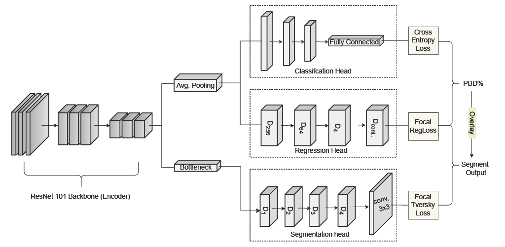
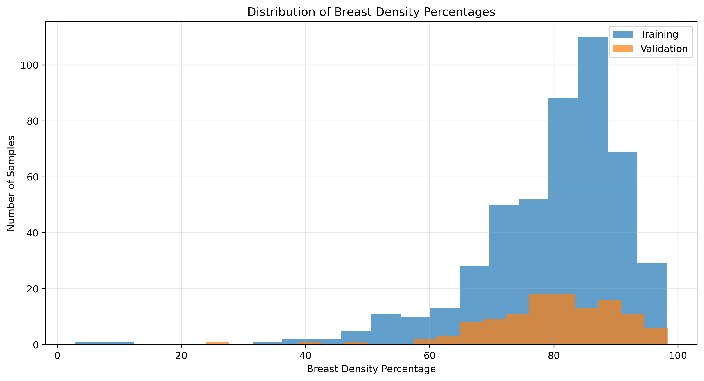
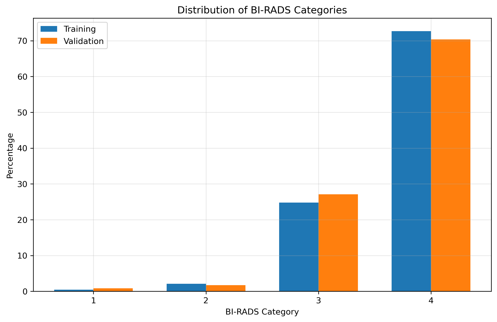
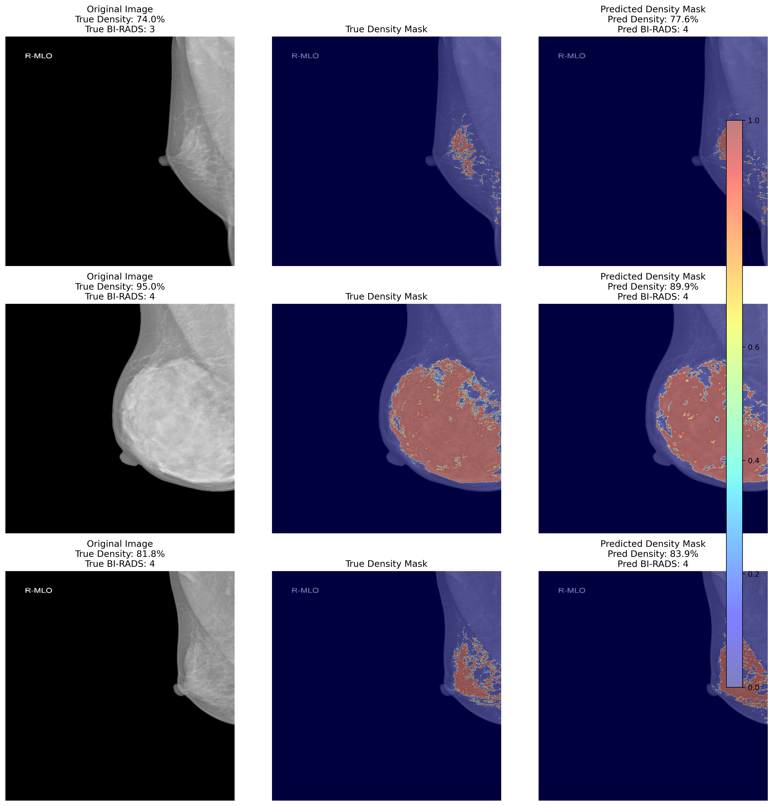
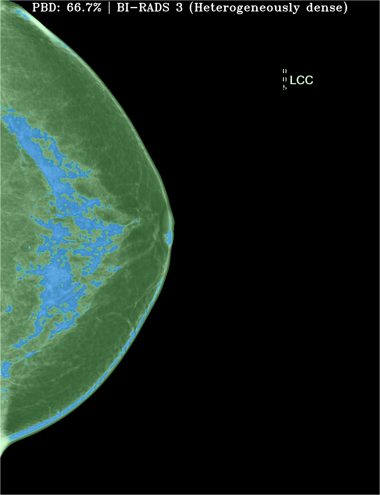

# [Unified Breast Density Segmentation and BI-RADS Class Estimation in 2D Mammograms with Multi-Head Convolutional Neural Network (MHCNN)](https://openreview.net/forum?id=fwmKiBGvD5#discussion)

This repository contains the official implementation of joint 2D breast mammogram segmentation and BI-RADS classification radiomics published at [2025 MIDL](https://openreview.net/pdf?id=fwmKiBGvD5) Short-Papers. This codebase performs the following tasks: 

1. Breast calcification tissue segmentation (pixel-level)
2. Breast density percentage regression (global prediction)
3. BI-RADS category classification (categorical prediction)


## Key Features

- **Multi-GPU Support**: Properly handles device placement for (nn.DataParallel) Distributed Training
- **Multi-Task Learning**: Joint optimization of segmentation, regression, and classification
- **DICOM Support**: Handles native DICOM format medical images
- **Data Augmentation**: Comprehensive augmentations designed for medical imaging
- **Device Management**: Robust handling of CPU/GPU placement
- **Error Recovery**: Error handling and recovery during training/inference
- **Performance Tracking**: Model statistics and visualization; Optimized data loading and batch processing


## Usage 

### Requirements
```
pip install -r requirements.txt
```
- PyTorch 2.0+
- CUDA (for GPU support)
- pydicom
- OpenCV
- albumentations
- segmentation_models_multi_tasking
- ptflops and thop (optional, for FLOP calculation)

### Training

```bash
python main.py \
    --data_path /path/to/dataset/train \
    --logs_file_path results/logs/training.txt \
    --model_save_path results/models/density_model.pth \
    --num_epochs 250 \
    --device_ids "0,1" # optional, for multi-GPU
```


### Inference

1. Runtime CMD:

```bash
python predict.py \
    --input_dir /path/to/dicom/images \
    --model_path /path/to/model.pth \
    --output_dir Results \
    --save_images \
    --save_csv
```

2. Containerized CMD (**Docker**): 

```bash
# Set up the package repository
distribution=$(. /etc/os-release;echo $ID$VERSION_ID)
curl -s -L https://nvidia.github.io/nvidia-docker/gpgkey | sudo apt-key add -
curl -s -L https://nvidia.github.io/nvidia-docker/$distribution/nvidia-docker.list | sudo tee /etc/apt/sources.list.d/nvidia-docker.list

# Install nvidia-docker
sudo apt-get update
sudo apt-get install -y nvidia-docker2
# Restart Docker daemon
sudo systemctl restart docker
```

```bash
sudo docker build -t mammo-infer .
docker build --no-cache -t mammo-infer .
```

```bash
docker run --rm --gpus all   -v $(pwd)/data:/workspace/data:ro   -v $(pwd)/output:/workspace/output   -v $(pwd)/docker_out:/workspace/docker_out   mammo-infer:latest   --input_dir data/dataset_name/test   --model_path output/models/density_model.pth   --output_dir docker_out/Results   --save_images
```

```bash
docker run --rm --gpus all \
  -v $(pwd)/data:/workspace/data:ro \
  -v $(pwd)/output:/workspace/output \
  -v $(pwd)/docker_out:/workspace/docker_out \
  mammo-infer:latest \
  --input_dir data/dataset_name/test \
  --model_path output/models/density_model.pth \
  --output_dir docker_out/Results \
  --save_images
```


## Model Architecture

The multi-head CNN model uses a triple-output-pathway:

1. **Segmentation Path**: Generates pixel-level density mask
2. **Regression Path**: Predicts global density percentage
3. **Classification Path**: Explicitly classifies into BI-RADS categories

<div align="center">
  
</div>

The encoder feature extraction is based on a shared ResNet-101 backbone. 


## Project Structure
```
MH-CNN Model/  
├── Dockerfile   
├── requirements.txt
├── .dockerignore  
├── src/
│   └── predict.py
├── data/
├── output/
└── README.md
```

The ``src`` codebase is divided into the following modular components:

- **device_checker.py**: Utilities for ensuring models are on the correct device for multi-GPU training
- **losses_metrics.py**: Loss functions, evaluation metrics, and BI-RADS classification utilities
- **dataset_br.py**: Dataset classes for loading DICOM mammograms and masks
- **density_model.py**: The model architecture with three output pathways
- **plots.py**: Visualization script for plotting model performance
- **param_stats.py**: Utilities for calculating model parameters and statistics
- **main.py**: Training script with multi-GPU support
- **predict.py**: Inference script for analyzing mammograms

### Data Preprocess Analysis 
590 data samples from [VinDr-Mammo](https://physionet.org/content/vindr-mammo/1.0.0/) benchmark 

<table>
  <tr>
    <td align="center">
      
    </td>
    <td align="center">
      
    </td>
  </tr>
</table>


## Outputs

Training produces:
- Model checkpoints (best, final, and periodic)
- Training curves (loss, Dice, MAE, BI-RADS accuracy)
- Confusion matrices for BI-RADS classification
- Density distribution plots
- Detailed training summary 

<p align="left">
  
  
</p>

Inference produces:
- Segmentation overlays as DICOM files
- Optional PNG images
- JSON metrics file
- Optional CSV summary file


## Citation 
BibTex: 
```
@inproceedings{MHCNN2025,
  author    = {Agbodike, Obinna and Kuo, Chang-Fu and Chen, Jenhui},
  title     = {Deep Multi-Head CNN for Unified Breast Density
               Segmentation and BI-RADS Estimation in 2D Mammograms},
  booktitle = {Medical Imaging with Deep Learning (MIDL)-Short Papers},
  year      = {2025},
  address   = {Salt Lake City, Utah, USA},
  url       = {https://openreview.net/pdf?id=fwmKiBGvD5}
}
```

## Acknowledgements
This work was sponsored by CAIM: Linkou, Chang Gung Memorial Hospital, under project grant no. CLRPG3H0016. 
